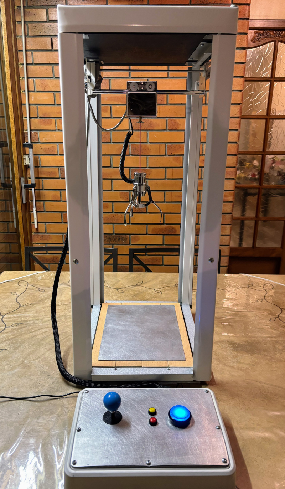
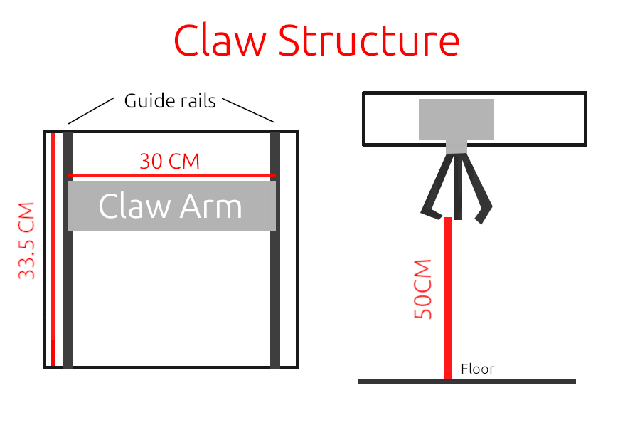
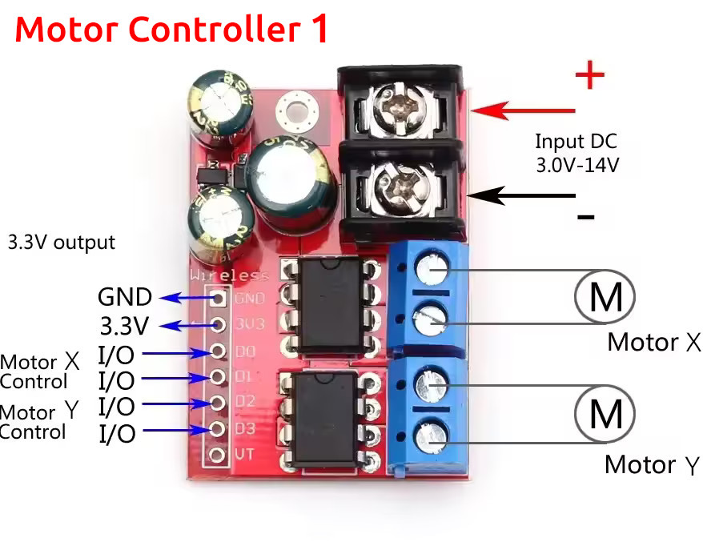
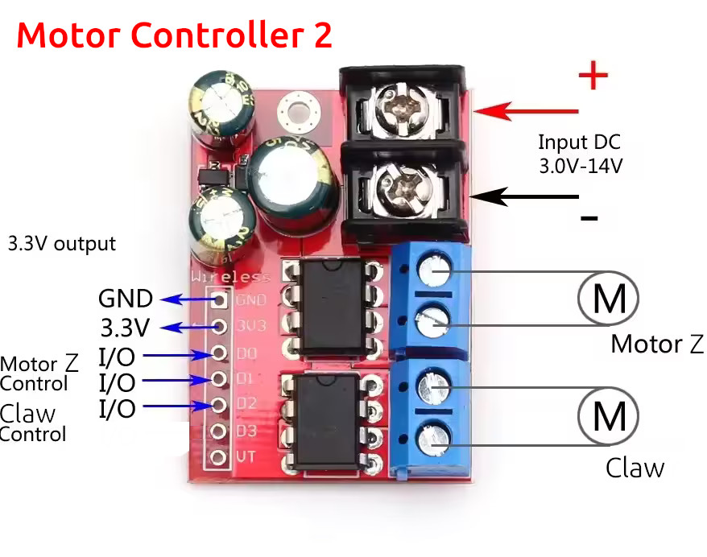
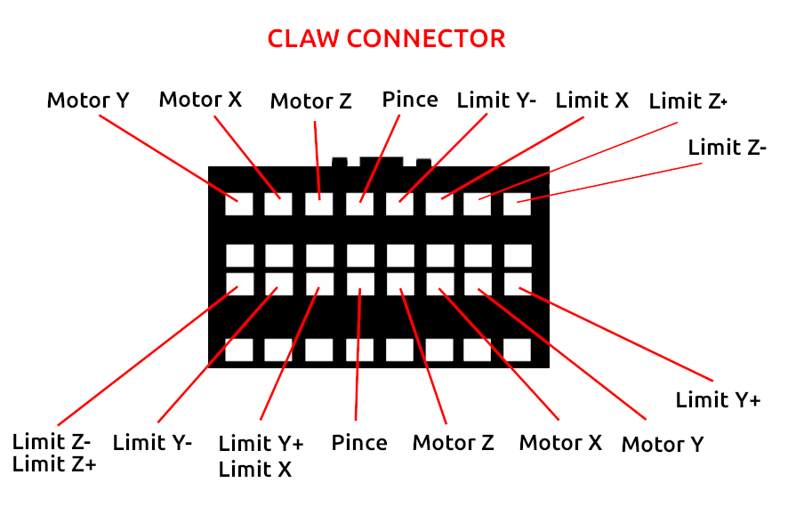
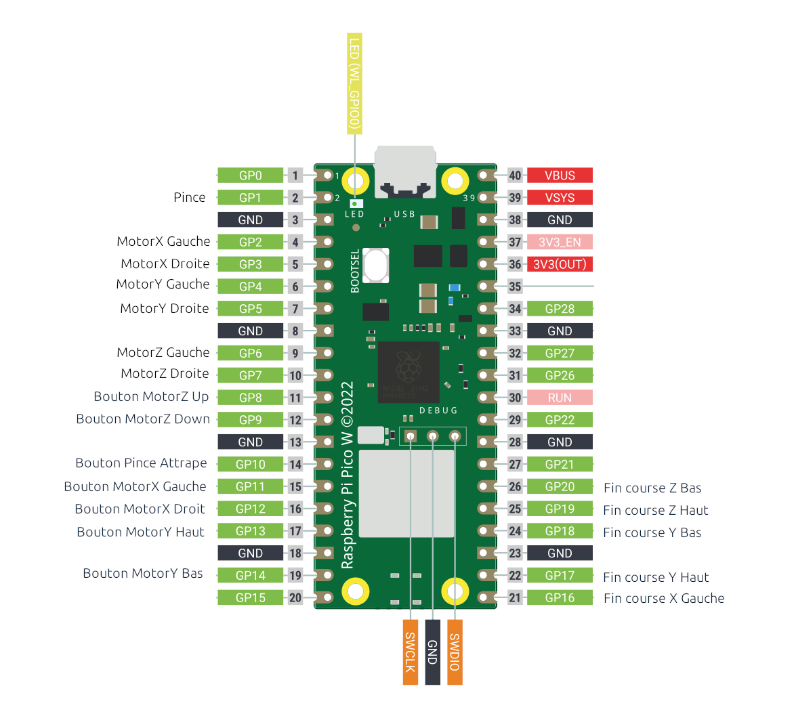

# Pico Claw Machine

DIY claw machine built using an affordable replacement claw powered by a Raspberry Pi Pico.

The claw machine works with free movement on all axes, making it an ideal toy for many different uses (Lego, Playmobil, etc.)

## Requirements:
- Raspberry Pico W with micro python (https://micropython.org/download/RPI_PICO_W/)
- Replacement Claw (https://fr.aliexpress.com/item/1005006730772049.html)
- Guide Rails (https://fr.aliexpress.com/item/1005007520507786.html)
- DC Motor Controller x2 (https://fr.aliexpress.com/item/1005006308936405.html)
- Some buttons and an arcade stick (https://fr.aliexpress.com/item/4000029640022.html)
- 12V power supply (reused a 12V 2.5A one from an old router)
- Male Dupont headers and some wires to create a custom cable that interfaces with the replacement claw’s connector (https://fr.aliexpress.com/item/1005006034877497.html)

**Note:** You'll need to build a structure capable of supporting the claw. I built mine using recycled materials, so I don't have any specific material references for its construction

## Micro Python

Download the .uf2 file from Raspberry Pi Pico W downloads (https://micropython.org/download/RPI_PICO_W/). Hold the `BOOT button` while plugging in your Pico, then drop the `.uf2` file onto the mounted Pico drive.

Use Thonny IDE or another method to write the `main.py` file.

## Installation

- Create a custom cable using 2x8 male dupont header to interface with the claw connector.
- Connect the X and Y motors to DC Motor Controller 1 and provide a 12V power supply.
- Connect the Z motor and the claw to DC Motor Controller 2 and provide a 12V power supply. 
- Connect both DC Motor Controllers to the Raspberry Pi Pico according to the pinout below
- Use the 3.3V out from one of the motor controller to power the Pico Vsys pin.
- Connect the necessary buttons and limits for operating the claw machine as shown in the pinout below.

**Note:** We use X, Y, and Z axes as if viewing the claw machine from above. X refers to the motor that controls the internal movement of the claw assembly, Y is the movement along the guide rails, and Z is the axis used to raise and lower the claw.

**Note:** First motor controller X with D0, D1 and Y with D2, D3. Second motor controller Z with D0, D1 and button claw (pince) with D2.

## Replacement Claw Pinout

## Pico W Pinout

## Additional Notes
- There is no official documentation available for the replacement claw. Based on testing, I assume the motors run on 12V and perform well at this voltage. The electromagnet also works adequately at 12V, but delivers stronger holding force when powered with 24V.
- The connector used for the replacement claw appears to be proprietary, I couldn’t find any reference or standard model for it. This is why creating a custom cable is useful.
- The limit switch for controlling the claw’s descent works as follows: when the claw is relieved of its own weight (when it touches the ground), the switch is triggered. Making easy to work with any height.
- For some reasons, the replacement claw includes motor limit switches on all axes and directions except for X (right). It might be a good idea to add one.
- The motor controllers support a voltage range of 5V to 14V, which allows you to adjust the movement speed or the claw’s gripping force as needed.